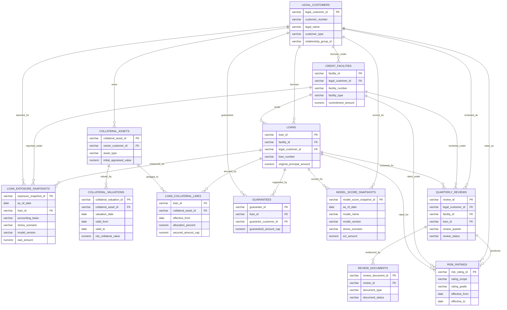

# Banking Credit Risk and Customer Exposure

This package models a compact banking risk scenario focused on legal customers, facilities, loans, exposure snapshots, collateral, guarantees, ratings, model scores, and quarterly review evidence.
It is designed to answer credit exposure questions without hiding the grains that make banking risk data difficult.

The analytical center is `loan_exposure_snapshots`: one row per loan, as-of date, accounting basis, stress scenario, and model run.
Collateral and guarantees attach through separate many-to-many paths, ratings and collateral valuations carry effective dates, and model scores keep scenario and model-version fields explicit so comparisons are deliberate.

