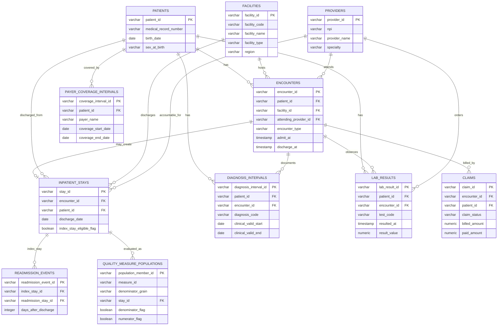

# Healthcare Patient Journey and Quality Measures

This package models a compact healthcare analytics scenario focused on patient journeys, inpatient discharge denominators, diagnosis intervals, lab observations, claims, payer coverage, and quality-measure populations. It is designed to keep clinical, billing, and regulatory grains separate while still making common questions easy to ask.

The analytical center is `inpatient_stays`: one row per inpatient stay and discharge. Encounters preserve broader clinical utilization, diagnosis intervals carry clinical valid dates, lab results remain observation facts, claims represent billing outcomes, payer coverage is selected by encounter date, and quality-measure population rows make the denominator grain explicit.

