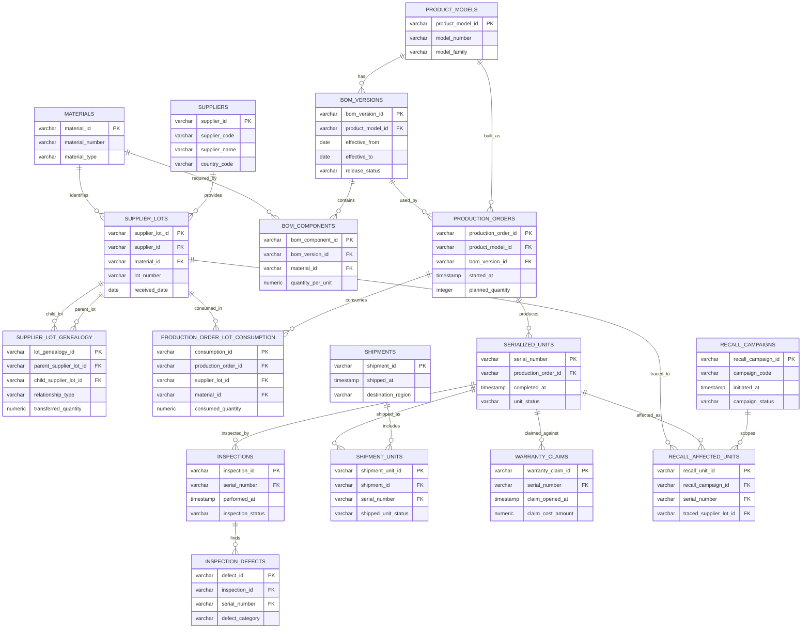

# Manufacturing Supply Chain Traceability and Quality

This package models a compact manufacturing analytics scenario focused on supplier lots, product BOM versions, production orders, serialized units, inspections, defects, shipments, warranty claims, and recall scope. It is designed to demonstrate traceability and quality analysis without flattening physical flow into one table.

The analytical center is `serialized_units`: one row per manufactured unit. Production orders bind each unit to the BOM version used at build time, supplier lot consumption records which lots fed each order, lot genealogy records split and merge relationships, inspections and defects attach at unit and inspection grain, shipments move units to customers, warranty claims attach after shipment, and recall affected units define the scoped population for campaigns.

