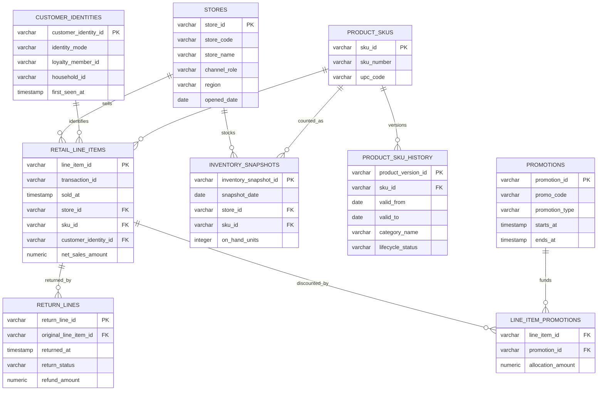

# Retail Omnichannel Margin and Returns

This package models a compact retail analytics scenario focused on line-item sales, returns, product history, stores, customer identity modes, promotions, and inventory snapshots. It is designed to demonstrate common retail questions without flattening different grains into one table.

The analytical center is `retail_line_items`: one row per sold SKU line. Returns and promotion allocations attach at line grain, product attributes are joined using valid-time history, stores provide channel and geography, customer identities distinguish loyalty, known guest, and anonymous shoppers, and inventory is modeled separately as daily SKU/store snapshots.

