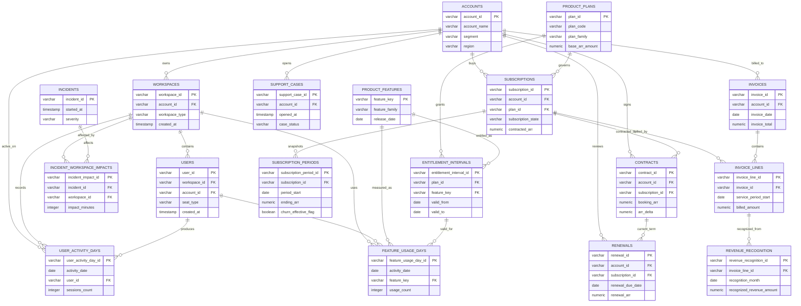

# SaaS Product Usage and Revenue

This package models a compact SaaS analytics scenario focused on accounts, workspaces, users, plans, subscriptions, contracts, invoices, revenue recognition, entitlements, product usage, support, incidents, and renewals. It is designed to answer recurring-revenue and product-adoption questions without flattening finance, usage, and lifecycle facts into one unsafe customer table.

The analytical center is `subscription_periods`: one row per subscription period with contracted ARR, MRR run-rate, expansion, contraction, and churn timing. Recognized revenue is modeled separately from invoice lines in `revenue_recognition`, product activity is modeled at user-day and feature-day grains, and entitlements are effective-dated so historical usage can be evaluated against the plan rights in force on the activity date.

